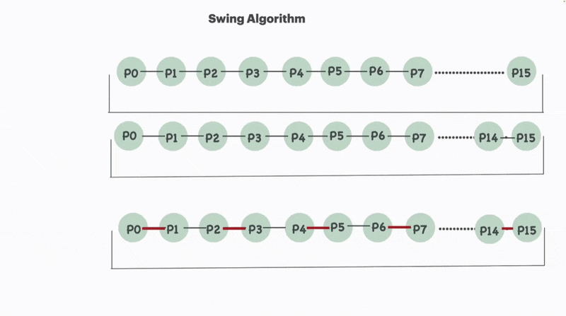

# 🌀 Swing AllReduce Simulator

*A C++ framework for simulating and analyzing AllReduce algorithms (Swing + Recursive Doubling) on Torus network topologies.*

---

## 📘 Introduction

This project implements a **high-level simulator and performance model** for collective communication algorithms—specifically **AllReduce**—running on **multi-dimensional torus networks** (like those used in modern supercomputers, TPUs, and large GPU clusters).

It includes:

- Torus topology generation
- Node & network modeling
- Abstract AllReduce interface
- Implementations of:
  - Swing (Bandwidth-Optimal + Latency-Optimal)
  - Recursive Doubling variants
  - ✨ Beyond the Paper: Baseline Implementation
To enable a complete performance comparison, this project extends significantly beyond the original paper's pseudo-code. While the paper explicitly defines the **Swing** algorithm, we independently derived and implemented the **Bucket**, **Hamiltonian Ring**, and **Recursive Doubling** algorithms purely from the theoretical descriptions in Section 2 of the paper. This allows the simulator to faithfully reproduce the comparative evaluation landscape and validates the Swing algorithm against the true state-of-the-art.
- Per-step communication tracing
- Bandwidth, latency & congestion estimation

- Simulating the performance comparison of the algorithms using SST-SIMULATOR on multiple nodes as given in the paper for mesh and torus topologies. The simulation found negligble changes on limited number of nodes due to hardware limitations and thus the inference has been taken from the SST_Simulator outputs as cited in the papers.


This work is based on the Swing paper (included in the repository): `/mnt/data/2024_Swing_NSDI_Paper.pdf`.

---

## Swing Demo- first 3 steps


---
## 📁 Project Structure

```
├── Node.h
├── NetworkTopology.h
├── TorusGenerator.h
├── AllreduceAlgorithm.h
├── SwingAlgorithm.h
├── RecursiveDoublingAlgorithm.h
└── examples/ (optional: driver, scripts, input configs)
```

---

## 🧩 File-by-file

### `Node.h`
- Represents a single rank/node in the torus.
- Contains: rank, coordinates, neighbor list, `data` and `recv_buffer` for simulation.
- Helpers: `getNeighbor(dimension, positive)`, `toString()`.

### `TorusGenerator.h`
- Builds `NetworkTopology` from a `TorusConfig`.
- Maps between linear ranks and multi-dimensional coordinates.
- Connects nodes with wrap-around neighbors (torus).
- Helpers: `linearToCoordinates`, `coordinatesToLinear`, `getNeighborRank`.

### `NetworkTopology.h`
- Holds `TorusConfig` and `vector<shared_ptr<Node>> nodes_`.
- Methods: `addNode`, `getNode`, `getAllNodes`, `exportToDot` (for visualization), and `printInfo`.
- Contains Torus configuration parameters: dimensions, `link_bandwidth_gbps`, `link_latency_ns`, `hop_latency_ns`.

### `AllreduceAlgorithm.h`
- Abstract base for allreduce algorithms.
- Exposes: `Statistics execute(NetworkTopology* topology, size_t vector_size_bytes)`.
- `Statistics` includes per-step `Step` entries: `(src, dst)` pairs, `data_size_bytes`, `description`, and aggregated metrics (total bytes, estimated time, goodput).

### `RecursiveDoublingAlgorithm.h`
- Implements XOR-pairing recursive-doubling (latency-optimal and bandwidth-optimal variants).
- Populates per-step communications using `peer = r ^ (1 << s)` for power-of-two ranks.
- Computes estimated times using topology bandwidth/latency.

### `SwingAlgorithm.h`
- Implements Swing algorithm (both bandwidth-optimal and latency-optimal variants).
- Implements `rho(s)`, `delta(s)`, and `pi(r,s)` utilities as in the paper.
- Bandwidth-optimal: reduce-scatter + allgather (data is halved each step).
- Latency-optimal: full-vector exchanges per step.
- Produces `Statistics` for analysis and simulator input.

---

## ⚙️ How it all connects (execution flow)

1. Create a `TorusConfig` with the target dimensions and link parameters.
2. Use `TorusGenerator(config).generate()` to create `NetworkTopology` with all `Node`s and neighbor links.
3. Instantiate an algorithm (`SwingAlgorithm` or `RecursiveDoublingAlgorithm`) and choose a variant.
4. Call `execute(topology, vector_size_bytes)` to get `Statistics` describing per-step communication and cost estimates.
5. Optionally export topology (`exportToDot`) or feed `Statistics` to an external network simulator.

---

## 🔧 Build & Run (example)

> This assumes you have a simple `main.cpp` driver that uses the headers. Adjust compile flags as needed.

```bash
# Example compile (g++)
g++ -std=c++17 -O2 -Iinclude -o swing_sim src/main.cpp

# Run: supply torus dims + vector size (example)
./swing_sim 8 8 8192
```

`main.cpp` typical responsibilities:
- Parse CLI args (dimensions, vector size, algorithm choice)
- Construct `TorusConfig`
- Generate `NetworkTopology`
- Run algorithm `execute(...)` and print `Statistics`
- Optionally call `exportToDot("topology.dot")`

---

## 🧪 Example usage (pseudo-code)

```cpp
TorusConfig cfg({8,8}, /*link_bw_gbps=*/25.6, /*link_latency_ns=*/100, /*hop_latency_ns=*/50);
auto topology = TorusGenerator(cfg).generate();

SwingAlgorithm swing(SwingAlgorithm::Variant::BANDWIDTH_OPTIMAL);
size_t vector_bytes = 8192;
AllreduceAlgorithm::Statistics stats = swing.execute(topology.get(), vector_bytes);

stats.print();
```

---

## ✅ Notes & Suggestions

- **Units**: `link_bandwidth_gbps` is Gbps, latencies are in ns. Ensure consistent units when modifying the timing model.
- **Data movement simulation**: Currently algorithms populate `Statistics` rather than moving values in `Node::data`. If you want a functional simulator (reduce actual values), add send/recv buffer ops in the algorithm steps.
- **Non-power-of-two ranks**: Algorithms include guards/handling for non power-of-two node counts. Review the paper's proxy mechanism if you plan to support many odd configurations.
- **Visualization**: Use `exportToDot` and `dot -Tpng topology.dot -o topology.png` to generate a visual of the network.

---

## 📚 Paper & References

The README references the Swing NSDI paper which is included in the repository at:

```
/mnt/data/2024_Swing_NSDI_Paper.pdf
```

## Presentation and Video
[https://drive.google.com/drive/folders/1W-9V5beAHGmvxyCAdN54r-taSv_BGOxg](https://drive.google.com/drive/folders/1W-9V5beAHGmvxyCAdN54r-taSv_BGOxg)


